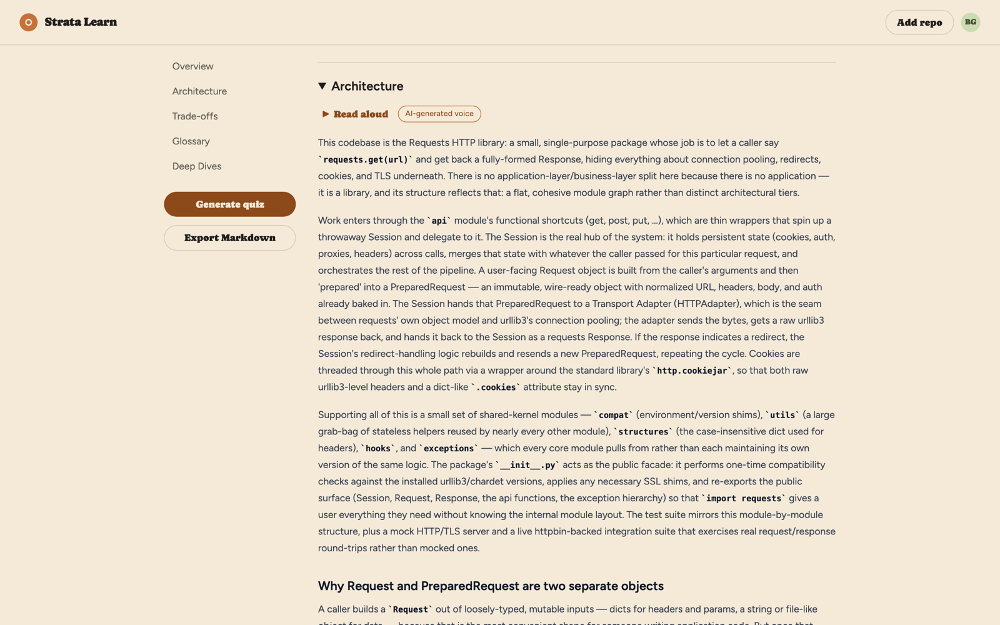
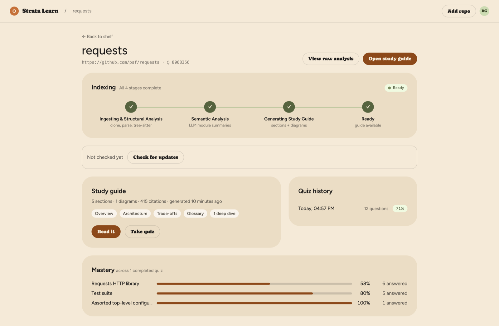
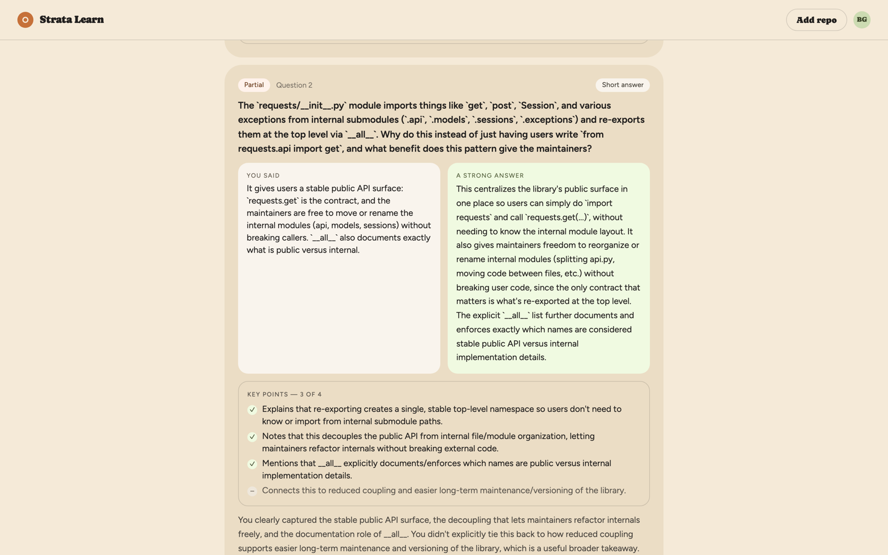
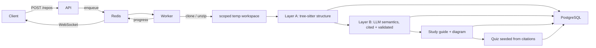

# Strata Learn

Point Strata Learn at a Git repository and it produces a citation-grounded **study guide** — architecture narrative, subsystem deep-dives, trade-offs, glossary, Mermaid diagram — and then a **quiz** that checks you understood *why* the code is the way it is, not just that it runs. It's built for the "I've just been handed a codebase" moment.

<p align="center">
  
</p>
<p align="center">
  
  
</p>
<p align="center"><sub>Shown: <a href="https://github.com/psf/requests">psf/requests</a> indexed and quizzed end to end.</sub></p>

## What it does

- **Ingest** a public Git URL or a zip upload; the source is analysed in a scoped temp workspace and never re-read afterwards ([ADR-008](docs/adr/ADR-008-no-local-filesystem-ingestion.md)).
- **Analyse** in two layers: deterministic structure first (tree-sitter parse, module/class/function extraction, dependency graph, entry points, subsystem partition), then LLM semantics over those facts — module summaries, subsystem naming, architecture-pattern detection, trade-off extraction — with every claim validated against the deterministic layer and cited to a real file/line range ([ADR-006](docs/adr/ADR-006-layer-a-layer-b-separation.md)).
- **Generate a study guide**: Overview, a synthesised Architecture explanation with a Mermaid diagram, Trade-offs, Glossary, and per-subsystem Deep-Dives, every section carrying clickable citations to the cited snippet. Export as Markdown.
- **Quiz you** with multiple-choice and short-answer questions seeded from the guide's own citations. Short answers are graded by an LLM judge against a rubric of key points, with a model answer and teaching-style feedback (immediate or end-of-quiz, your choice). Mastery is tracked per subsystem across attempts.
- **Keep up with the repo**: staleness detection against the remote, one-click re-index, and a "What changed" architectural diff between snapshots.
- **Voice**: read any section or feedback aloud, and dictate short answers into an editable transcript. Runs locally by default (faster-whisper + Kokoro), no key or bill required ([ADR-010](docs/adr/ADR-010-voice-providers-and-self-hosted-backends.md)).
- **Single-tenant, cookie-session auth** hand-built as a learning exercise ([ADR-007](docs/adr/ADR-007-self-implemented-auth.md)); first run walks you through creating the one account.

**Supported languages:** the deterministic layer parses **Python** and **JavaScript/TypeScript**. Repositories in other languages will index but produce a thin guide; more grammars are on the [roadmap](#roadmap).

**Cost:** semantic analysis, study-guide generation, and quiz generation/grading call Anthropic (`claude-sonnet-5`, one model for everything). Indexing a small repository and generating and taking a quiz has come to roughly **$1** in API usage; larger repositories cost more, and re-indexing costs a full index again (incremental re-index is [#114](https://github.com/bghannum/strata-learn/issues/114)). Nothing calls a paid API without you starting an index, a quiz, or a grading — automated tests use a fake provider.

## Quickstart

Prerequisites: Docker 24+ with Compose v2, Git, and an [Anthropic API key](https://console.anthropic.com/).

```bash
git clone https://github.com/bghannum/strata-learn.git
cd strata-learn
cp .env.example .env
# Set ANTHROPIC_API_KEY in .env. Nothing else is required.
docker compose up --build
```

Then open <http://localhost:5173>. Compose starts PostgreSQL, Redis, the FastAPI service, the arq worker, and the Vite dev server; `curl http://localhost:8000/health` returns `{"status":"ok"}` and interactive API docs are at <http://localhost:8000/docs>.

The first visit lands on **Set up your account**: pick an email and password and that becomes the app's single account. Setup closes permanently once it exists; later visits log in normally and a session lasts 30 days. Forgot the password? `./scripts/reset-password you@example.com` sets a new one and signs out every open session — there's deliberately no email-based reset, since shell access to the install is the only proof it's you.

Add a repository from the Dashboard, watch it index live, open the study guide when it's ready, then generate a quiz from the repo page.

On first start the API also downloads the local voice models (~500 MB) in the background; read-aloud and spoken answers appear once `docker compose logs api` shows `voice.speech warm` and `voice.transcription warm`. Everything else works immediately. Set `INSTALL_VOICE=false` for a slimmer image, point `TRANSCRIPTION_BACKEND` / `SPEECH_BACKEND` at `openai` with an `OPENAI_API_KEY`, or leave them blank to turn voice off.

Stop the stack with `docker compose down`. Add `-v` only when you intentionally want to delete the local PostgreSQL volume.

## Security posture — read before exposing it

Strata Learn is a **localhost tool**. It has not been hardened for the open internet: there is no CSRF protection, no login rate limiting, and no expired-session cleanup yet (all tracked in the [Productionization milestone](https://github.com/bghannum/strata-learn/milestone/9)). If you must reach it from anywhere but your own machine, at minimum set `REGISTRATION_SECRET` in `.env` *before* the first start so a stranger who reaches a fresh install can't claim the account, and put it behind a reverse proxy with TLS — the microphone features require a secure context anyway. See [`SECURITY.md`](SECURITY.md).

## How it works



A modular monolith ([ADR-001](docs/adr/ADR-001-modular-monolith.md)): FastAPI API, an arq worker on Redis ([ADR-002](docs/adr/ADR-002-async-job-queue.md)), PostgreSQL, and a React/Vite frontend. LLM prompts are versioned Markdown under [`docs/prompts/`](docs/prompts/) and loaded at runtime. The full component, pipeline, data-model, and endpoint reference is [`docs/architecture.md`](docs/architecture.md); the [documentation index](docs/README.md) says which document is canonical for what.

## Roadmap

The MVP is complete (August 2026; the phase-by-phase story is in [`docs/history/build-phases.md`](docs/history/build-phases.md)). What's next, roughly in order — each is a GitHub Milestone with concrete issues:

1. **[Study-guide depth](https://github.com/bghannum/strata-learn/milestone/11)** — per-subsystem deep-dives with a request-flow walkthrough, a data-model section, a "how to run/test/extend" section, and a learner-chosen focus that biases what gets written. Cheapest big win: quizzes seed from the guide, so depth compounds.
2. **[Assessment: question types, tests, spaced repetition](https://github.com/bghannum/strata-learn/milestone/12)** — code-reading, ordering, and spot-the-trade-off questions; a real timed *test* mode with a pass threshold distinct from practice quizzes; spaced repetition over the existing per-subsystem mastery; flag/regenerate a bad question; adaptive difficulty.
3. **[Drawing questions](https://github.com/bghannum/strata-learn/milestone/8)** — sketch the architecture on a constrained tldraw canvas, graded by a deterministic graph diff against the reference. The design is already written ([ADR-005](docs/adr/ADR-005-drawing-question-graph-data.md)); this was the original Phase 6 and was deferred.
4. **[Productionization](https://github.com/bghannum/strata-learn/milestone/9)** — Caddy/TLS, a production Compose topology, CSRF, rate limiting, session cleanup, backups. Prerequisite for the next item.
5. **[Multi-user support](https://github.com/bghannum/strata-learn/milestone/13)** — real registration or invites, an admin role, shared study guides so a team indexes once, GitHub OAuth. Supersedes the single-account rule in ADR-007.
6. **[Broader language support](https://github.com/bghannum/strata-learn/milestone/14)** — Go, Rust, Java via tree-sitter, and an honest fallback for everything else.
7. Smaller items: an [OpenAI / local Ollama text-LLM provider](https://github.com/bghannum/strata-learn/issues/112), [private-repo ingestion](https://github.com/bghannum/strata-learn/issues/113), [incremental re-index](https://github.com/bghannum/strata-learn/issues/114).

Everything actionable lives in [GitHub Issues](https://github.com/bghannum/strata-learn/issues); [`docs/history/resolved-engineering-issues.md`](docs/history/resolved-engineering-issues.md) is a log of non-obvious bugs already fixed, not a backlog.

## Development

### Without Docker

Start PostgreSQL and Redis (`docker compose up postgres redis`), then:

```bash
cd backend
python3.12 -m venv .venv && source .venv/bin/activate
pip install -e ".[dev,voice]"     # drop `voice` to skip the local audio runtimes
alembic upgrade head
uvicorn app.main:app --reload     # API
arq app.worker.tasks.WorkerSettings   # worker, in a second terminal
```

```bash
cd frontend
npm install
npm run dev
```

The root `.env` is resolved whether backend commands run from the repository root or `backend/`. Python 3.12 and Node.js 20+ are required.

### Hot reload caveats (Docker)

The API and frontend containers hot-reload from the mounted source, but the **worker does not** — arq loads the code once at start. After changing anything under `app/quizzing/`, `app/generation/`, `app/semantics/`, or `app/worker/`, run `docker compose restart worker`. Changes to `.env` need `docker compose up -d api worker` (recreate), not `restart`.

### Tests

```bash
cd backend && pytest -q                     # real PostgreSQL + Redis, FakeLLMProvider — no paid calls
cd frontend && npm run lint && npm test && npm run build
cd frontend && npm run test:e2e             # Playwright; needs `npx playwright install chromium` once
```

Backend tests run against a dedicated `strata_learn_test` database — derived from `DATABASE_URL`, created and migrated automatically on the first run, overridable with `TEST_DATABASE_URL` — and refuse to start if it resolves to the same database as `DATABASE_URL`, so a test run never touches your indexed repos.

CI runs all of the above on every pull request. AI code review is deliberate rather than push-triggered: `./scripts/codex-review` writes a gitignored `CODEX_CODE_REVIEW.md`. The branch/PR/review process is in [`docs/development/workflow.md`](docs/development/workflow.md); contribution expectations are in [`CONTRIBUTING.md`](CONTRIBUTING.md).

### Database migrations

From `backend/` with the virtual environment active: `alembic upgrade head`, `alembic revision --autogenerate -m "message"`.

## Repository map

```text
strata-learn/
├── backend/             FastAPI, analysis pipeline, arq worker, tests, voice-eval harness
├── frontend/            React/Vite app: ingest repos, read guides, take quizzes
├── docs/
│   ├── adr/             Architecture decision records
│   ├── architecture.md  Implemented system, data model, and API surface
│   ├── design/          UI spec, original plan, checked-in mockups
│   ├── development/     Contributor workflow
│   ├── history/         Build phases, resolved issues, retired experiments, voice eval report
│   ├── prompts/         Versioned runtime LLM prompt templates
│   └── screenshots/     README images
├── scripts/             codex-review, reset-password, voice-eval
└── docker-compose.yml   Local service topology
```

## License

[MIT](LICENSE).
