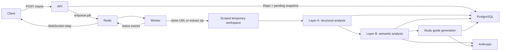

# Current architecture

**Status:** Current through Phase 5, in progress.

Strata Learn is a Docker Compose-based modular monolith that ingests a Git repository or uploaded zip, extracts deterministic structural facts, enriches them with citation-grounded LLM analysis, assembles the result into a study guide, and lets a logged-in user generate and take a quiz against it — all through a working frontend. Drawing questions and hosting remain future phases.

## System components

| Component | Technology | Current responsibility |
|---|---|---|
| API | FastAPI | Auth (register/login/session), repository ingestion, repository/snapshot lookup, progress WebSocket, study guide lookup, quiz generation trigger/lookup, and attempt taking/grading |
| Worker | arq | Source preparation, Layer A analysis, Layer B analysis, study guide generation, quiz generation, persistence, and status publication |
| Database | PostgreSQL 16 | Users/sessions, repositories, snapshots, code units, module summaries, pattern claims, trade-off cards, study guides/sections/citations, and quizzes/questions/attempts/answer submissions |
| Queue/events | Redis 7 | arq jobs, temporary zip bytes, and snapshot progress pub/sub |
| Frontend | React/Vite | Register/login, add repo, live indexing progress, study guide reading (diagram + citations), quiz generation + taking, and results |
| LLM provider | Anthropic | Claude-backed structured output for Layer B tasks, quiz question generation, and fill-in-the-blank concept-mode grading |

The code exposes an `LLMProvider` protocol and a deterministic `FakeLLMProvider` for tests. An OpenAI production provider is planned but not implemented.

## Indexing flow



### Source preparation

- Git sources are pre-checked by the API and cloned independently by the worker.
- Zip uploads are size/file-count validated; their bytes live temporarily in Redis so the API and worker do not require a shared filesystem.
- Each job uses a scoped temporary workspace that is cleaned after processing.
- Symlinks are excluded before source can reach the parser or an external LLM.

### Layer A: deterministic analysis

Layer A walks supported source files, detects Python and JavaScript/TypeScript, parses them with tree-sitter, extracts modules/classes/functions, builds a dependency graph, and identifies likely entry points. It persists `CodeUnit` rows and structural JSON on `AnalysisSnapshot` without making LLM calls.

### Layer B: semantic analysis

Layer B runs after Layer A and currently uses one Anthropic model for three tasks:

- module summaries;
- architectural pattern detection;
- trade-off extraction.

The implementation bounds request volume, validates model-provided evidence against Layer A facts, and stores prompt version and model provenance with every result. Automated tests use `FakeLLMProvider`; real provider calls occur only during manual checkpoints or normal application use.

Versioned templates under [`docs/prompts/`](prompts/) are runtime inputs, not passive prose.

### Study guide generation

Runs after Layer B and assembles its output (plus Layer A facts) into a study guide: Overview, Architecture, Trade-offs, Glossary, and Deep-Dive sections, each with citations back to real source lines. The only new LLM call is short labels for a Mermaid component diagram built from the (already-deterministic) dependency graph; every other section is deterministic formatting of already-generated, already-cited Layer B rows. A crash between Layer B's commit and the guide's commit resumes on redelivery without re-running Layer B's billed calls, reacquiring source pinned to the originally analyzed commit rather than the branch's current tip.

### Quiz generation and taking

Runs on demand, well after study guide generation — the two are decoupled in time, not chained in the same job. `POST /quizzes/{repo_id}/generate` creates a `Quiz` row (`generating`) and enqueues a separate `generate_quiz` arq job, then the client polls `GET /quizzes/{id}` until it reaches a terminal status (no progress WebSocket for this stage — see `worker/quiz_pipeline.py`'s docstring for why polling is enough here).

Quiz generation never re-reads the source repo (by this point the temp workspace is long gone, per ADR-008): it builds questions from `Citation` rows the study guide already persisted, each with a real snippet captured while the repo was still on disk. A bounded, deduped, priority-ranked subset of citations becomes "seeds," alternately fed to the MCQ and fill-in-the-blank generators (`quizzing/mcq_generator.py`, `quizzing/fill_blank_generator.py`); each `Question`'s `file_path`/`line_start`/`line_end` is taken directly from its seed citation rather than trusted from the model's own output, since there's no independent evidence to validate a free-form citation against here (unlike `tradeoff_extractor.py`'s `CodeUnit`-checked refs).

Grading is immediate, not deferred to quiz completion. `PATCH /attempts/{id}/answers/{qid}` grades the instant an answer is submitted: MCQ is a deterministic index comparison; fill-in-the-blank tries an exact/alternative-text match first, and only a concept-mode miss falls through to a real LLM-judge call — made directly from the API request (not a worker job), since it's one cheap call gating one HTTP response. `GET /quizzes/{id}` never includes the answer key (`correct_index`, `correct_answer`, `explanation`); those only appear in a `PATCH` response, after that specific question has been answered. `POST /attempts/{id}/complete` averages every question's score (unanswered counts as zero) into `Attempt.score`.

### Frontend

React + Vite + Tailwind, talking to the API over `fetch`/`WebSocket`, with every request carrying an `HttpOnly` session cookie (`credentials: 'include'`) as of Phase 4b. `Register`/`Login` handle account creation and session establishment; `AddRepo` submits a Git URL or zip upload; `Dashboard` and `RepoDetail` subscribe to `WS /repos/{id}/progress` and render a shared 5-stage status component (`IndexingProgress`, chip and stepper variants) — a failure shows which stage it happened at, not just a generic error. `StudyGuideView` renders `content_md` as Markdown, `diagram_mermaid` inline via the `mermaid` package, and each section's citations as a list that opens a `CitationPanel` slide-over with the real cited snippet. Citations render as a per-section list rather than markers inline on the specific claim — `claim_excerpt` isn't always a literal substring of `content_md` (e.g. the Architecture section's citations pair the primary-pattern headline with a specific evidence claim), so precise inline anchoring isn't reliable yet. `RepoDetail` also offers "Generate Quiz" once a study guide exists, polling until it's ready; `QuizTaker` walks one question at a time with immediate per-answer feedback; `AttemptResults` shows the final score and a per-question breakdown with its source reference, loaded fresh from `GET /attempts/{id}` so the page works on a direct visit or refresh, not only right after finishing.

## Persistence model

Implemented tables are:

- `User` and `Session` — self-implemented, DB-backed session auth (ADR-007); every router requires a valid session as of Phase 4b;
- `Repo` — an ingested source, its owning user, and a pointer to its latest snapshot;
- `AnalysisSnapshot` — one indexed state plus status and Layer A graph data;
- `CodeUnit` — a parsed module, class, or function;
- `ModuleSummary`, `PatternClaim`, and `TradeoffCard` — citation-grounded Layer B output;
- `StudyGuide`, `Section`, and `Citation` — the assembled study guide and its per-claim citations;
- `Quiz` and `Question` — a generated quiz and its MCQ/fill-in-the-blank questions, each grounded in one source `Citation`;
- `Attempt` and `AnswerSubmission` — one user's pass at a quiz and their per-question answers/scores/feedback.

Drawing-question tables (§12 Phase 6) are not implemented yet.

## Status lifecycle

```text
pending → parsing → analyzing → generating → ready
                            ↘ failed
```

The worker commits final Layer B rows with `generating` atomically, and the study guide rows with `ready` atomically, to reduce duplicate paid work under arq's at-least-once delivery model. A redelivery landing between those two commits resumes directly into study guide generation instead of repeating Layer B.

`Quiz.status` is a separate, simpler lifecycle: `generating → ready`, or `→ failed`. It's a single-stage job (no source to acquire, nothing to resume mid-flight), so there's no intermediate status to redeliver into — a redelivery of an already-`ready` or already-`failed` quiz job is a no-op short-circuit rather than a resume point.

## Implemented API

| Method | Path | Purpose |
|---|---|---|
| `GET` | `/health` | Liveness response |
| `POST` | `/auth/register` | Create the (single-tenant, secret-gated) account and start a session |
| `POST` | `/auth/login` | Start a session for an existing account |
| `POST` | `/auth/logout` | End the current session |
| `GET` | `/auth/me` | Fetch the logged-in user |
| `POST` | `/repos` | Validate and enqueue a Git URL or zip upload |
| `GET` | `/repos` | List the current user's repositories |
| `GET` | `/repos/{repo_id}` | Fetch a repository |
| `GET` | `/repos/{repo_id}/snapshot` | Fetch its latest analysis snapshot |
| `GET` | `/repos/{repo_id}/study-guide` | Redirect to its generated study guide |
| `GET` | `/study-guides/{study_guide_id}` | Fetch a study guide with ordered sections and citations |
| `WS` | `/repos/{repo_id}/progress` | Stream persisted and pub/sub status updates |
| `POST` | `/quizzes/{repo_id}/generate` | Create a pending quiz and enqueue generation |
| `GET` | `/quizzes/{quiz_id}` | Fetch a quiz's status and (once ready) its questions, answer key withheld |
| `POST` | `/attempts` | Start an attempt at a quiz |
| `PATCH` | `/attempts/{attempt_id}/answers/{question_id}` | Submit and immediately grade one answer |
| `POST` | `/attempts/{attempt_id}/complete` | Finalize an attempt's score and return full results |
| `GET` | `/attempts/{attempt_id}` | Fetch an attempt's current results (supports a direct visit or refresh) |

The broader API in the [original project plan](design/original-project-plan.md) is a target surface, not a description of current routes.

## Deployment topology

Local Docker Compose starts five services: PostgreSQL, Redis, API, worker, and web. Both the API and worker containers mount `docs/prompts` read-only, because prompt templates live outside the backend image — the worker needed this from Phase 2 for its own generation jobs, and the API needed the same mount added in Phase 5 once `PATCH /attempts/{id}/answers/{qid}`'s fill-in-the-blank concept-mode grading started calling `load_prompt()` directly from the request path rather than only from a worker job. The current deployment target is local development; VPS hosting remains planned for Phase 7.

## Decision references

Major architectural rationale lives in [`docs/adr/`](adr/), especially:

- [ADR-001: modular monolith](adr/ADR-001-modular-monolith.md)
- [ADR-002: async job queue](adr/ADR-002-async-job-queue.md)
- [ADR-003: LLM provider abstraction](adr/ADR-003-llm-provider-abstraction.md)
- [ADR-006: Layer A/Layer B separation](adr/ADR-006-layer-a-layer-b-separation.md)
- [ADR-007: self-implemented auth](adr/ADR-007-self-implemented-auth.md)
- [ADR-008: no local-filesystem ingestion](adr/ADR-008-no-local-filesystem-ingestion.md)
- [ADR-009: LLM providers](adr/ADR-009-llm-providers.md)
