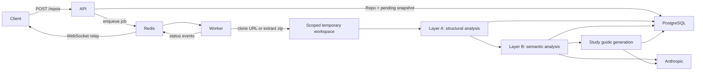

# Current architecture

**Status:** Current through Phase 7 (versioning and mastery); Phase 8 voice learning is next. Hosting moved to a separate Productionization milestone — see the README.

Strata Learn is a Docker Compose-based modular monolith that ingests a Git repository or uploaded zip, extracts deterministic structural facts, enriches them with citation-grounded LLM analysis, assembles the result into a study guide, and lets a logged-in user generate and take a quiz against it — all through a working frontend styled to the checked-in UI mockup. Improving the quality of what gets generated — conceptual explanation over per-file indexing — is the current phase; versioning/hosting polish, voice learning, and drawing questions follow it.

## System components

| Component | Technology | Current responsibility |
|---|---|---|
| API | FastAPI | Auth (register/login/session), repository ingestion, repository/snapshot lookup, progress WebSocket, study guide lookup, quiz generation trigger/lookup, and attempt taking/grading |
| Worker | arq | Source preparation, Layer A analysis, Layer B analysis, study guide generation, quiz generation, persistence, and status publication |
| Database | PostgreSQL 16 | Users/sessions, repositories, snapshots, code units, module summaries, subsystems, pattern claims, trade-off cards, cached generated artifacts, study guides/sections/citations, and quizzes/questions/attempts/answer submissions |
| Queue/events | Redis 7 | arq jobs, temporary zip bytes, and snapshot progress pub/sub |
| Frontend | React/Vite | Register/login, add repo, live indexing progress, study guide reading (diagram + citations), quiz generation + taking, and results |
| LLM provider | Anthropic | Claude-backed structured output for Layer B tasks, the architecture narrative and diagram labels, quiz question generation, and fill-in-the-blank concept-mode grading |

The code exposes an `LLMProvider` protocol and a deterministic `FakeLLMProvider` for tests. An OpenAI production provider is planned but not implemented.

## Indexing flow



### Source preparation

- Git sources are pre-checked by the API and cloned independently by the worker.
- Zip uploads are size/file-count validated; their bytes live temporarily in Redis so the API and worker do not require a shared filesystem.
- Each job uses a scoped temporary workspace that is cleaned after processing.
- Symlinks are excluded before source can reach the parser or an external LLM.

### Layer A: deterministic analysis

Layer A walks supported source files, detects Python and JavaScript/TypeScript, parses them with tree-sitter, extracts modules/classes/functions, builds a dependency graph, and identifies likely entry points. It persists `CodeUnit` rows and structural JSON on `AnalysisSnapshot` without making LLM calls.

### Layer B: semantic analysis

Layer B runs after Layer A and currently uses one Anthropic model for four tasks:

- module summaries;
- subsystem naming;
- architectural pattern detection;
- trade-off extraction.

Subsystem naming is the narrowest of the four. `analysis/subsystems.py` partitions the snapshot's files into subsystems deterministically — directory structure decides membership, and the dependency graph decides only the outside-in ordering (BFS depth from the entry-point files) — and the model supplies a human name and one-line role per group, in a single call for the whole partition. Membership is never sent back for revision, so this stays inside ADR-006's "LLM adds labels/grouping" allowance. Directory structure rather than graph community detection is deliberate: community detection flips on small edge changes, which would surface as architectural churn between re-indexes of nearly identical code once Phase 7 diffs snapshots.

The implementation bounds request volume, validates model-provided evidence against Layer A facts, and stores prompt version and model provenance with every result. Automated tests use `FakeLLMProvider`; real provider calls occur only during manual checkpoints or normal application use.

Versioned templates under [`docs/prompts/`](prompts/) are runtime inputs, not passive prose.

### Study guide generation

Runs after Layer B and assembles its output (plus Layer A facts) into a study guide: Overview, Architecture, Trade-offs, Glossary, and Deep-Dive sections, each with citations back to real source lines.

Two LLM calls happen here. One produces short labels for a Mermaid component diagram built from the (already-deterministic) dependency graph. The other is the Architecture section's narrative (`generation/architecture_narrative.py`): a synthesis pass over the pattern claim, subsystems, trade-off cards, and entry points that explains how the system works and why it is built that way. Its citations are attached *after* drafting — the model writes, then names which of the files it was given back each part, and those paths resolve against real `CodeUnit` line ranges, with unresolvable paths dropped rather than persisted with a fabricated range. Before this existed the section was pure string templating over `PatternClaim`, which is why it read as a citation list rather than an explanation; the pattern label and evidence bullets are still rendered, below the narrative in a collapsed block.

Every other section remains deterministic formatting of already-generated, already-cited rows. Deep Dives group by subsystem in the partition's outside-in order rather than listing files alphabetically.

A crash between Layer B's commit and the guide's commit resumes on redelivery without re-running Layer B's billed calls, reacquiring source pinned to the originally analyzed commit rather than the branch's current tip. Study guide assembly itself does re-run on that path, including its own two LLM calls.

### Versioning, staleness, and mastery

Re-indexing accumulates snapshots rather than replacing them, so a repository
carries its own history. Three features read that history.

Re-indexing is the same mechanism for two intents: retrying a `failed` run and picking up new commits on a `ready` one. A ready repo is refused unless the remote has actually moved, or `force` is passed — re-running the pipeline spends its most expensive part to regenerate what already exists, which is a reasonable thing to ask for deliberately and a bad thing to do by double-click. A snapshot still indexing is refused outright, since a second job would race the first.

**Staleness** compares a snapshot's `commit_hash` to the remote's current HEAD.
Checking is an explicit user action, never a page load: `git ls-remote` is a
network round trip to a third party that can hang, so `POST
/repos/{id}/check-updates` does the call and `GET /repos/{id}/update-status`
only reads what it recorded. Only the raw observation is stored — a derived
"stale" flag would go wrong the moment a reindex changed the other half of the
comparison without anyone re-checking.

**The architectural diff** (`generation/diffing.py`) compares two snapshots
across subsystems, trade-off cards, the pattern claim, and dependency edges.
Nothing matches on generated text: two runs of the same prompt over identical
code produce differently-worded output, and a naive text diff would report
churn that isn't real. Subsystems match on their stable key, trade-off cards on
the set of files their evidence cites, and dependency edges are projected up to
subsystem level before diffing so a refactor reads as one line rather than
forty. `RepoDetail`'s "What changed" panel is the read side (#72): it appears
only once a repo has two versions to compare, defaults to the newest pair, and
renders an explicit "nothing changed architecturally" state, since an identical
re-index legitimately produces a fully empty diff. `GET
/repos/{id}/study-guides` supplies the version picker — identifying fields
only, ordered by version rather than by timestamp so the picker can't label a
diff backwards relative to the direction the diff endpoint chooses.

**Mastery** (`quizzing/mastery.py`) aggregates graded answers by
`Question.subsystem_key`, which is copied onto the question at generation time
precisely because every `Section`, `Question`, and `Citation` row is replaced by
a re-index — aggregating on any of those would reset a learner's history at the
moment it became interesting. Only completed attempts count, and only the most
recent attempt per quiz, since a retake covers the same questions and isn't an
independent measurement.

`GET /repos/{id}/attempts` answers the neighbouring but different question —
what happened in each sitting, rather than how each topic is going. Mastery
cannot produce that: it aggregates answers by subsystem across attempts, so it
has no row that says "80% on a five-question quiz, this afternoon". Retakes are
included, because the history panel is a log rather than a measurement — which
is also why the response is a bounded page rather than a list (#75): retakes are
unlimited, so both the payload and the DOM would otherwise grow without a
ceiling. It returns the ten most recent by default alongside the full `total`,
capped at 100, and the panel's "show all" raises the request to that ceiling
rather than removing it.

### Quiz generation and taking

Runs on demand, well after study guide generation — the two are decoupled in time, not chained in the same job. `POST /quizzes/{repo_id}/generate` creates a `Quiz` row (`generating`) and enqueues a separate `generate_quiz` arq job, then the client polls `GET /quizzes/{id}` until it reaches a terminal status (no progress WebSocket for this stage — see `worker/quiz_pipeline.py`'s docstring for why polling is enough here).

Quiz generation never re-reads the source repo (by this point the temp workspace is long gone, per ADR-008): it builds questions from `Citation` rows the study guide already persisted, each with a real snippet captured while the repo was still on disk. A bounded, deduped, priority-ranked subset of citations becomes "seeds," alternately fed to the MCQ and fill-in-the-blank generators (`quizzing/mcq_generator.py`, `quizzing/fill_blank_generator.py`). Deduplication is by claim as well as by line range — a trade-off card gives every one of its evidence refs the same `claim_excerpt` at different ranges, so range-only dedup let one card seed several near-identical questions — and seeds spread across subsystems within each priority tier rather than taking an alphabetical prefix, so a quiz can't come entirely from whichever directory sorts first. each `Question`'s `file_path`/`line_start`/`line_end` is taken directly from its seed citation rather than trusted from the model's own output, since there's no independent evidence to validate a free-form citation against here (unlike `tradeoff_extractor.py`'s `CodeUnit`-checked refs). `Question.source_citation_id` also keeps the seed `Citation`'s own id — the file/line range alone can't identify one specific `Citation` row when the same range is cited by more than one `Section` — so `AttemptResults` can show the real cited claim and snippet, not just a path. A guide too thin to seed any questions from (or a run where every generated result fails its generator's own validation) fails the quiz rather than persisting an empty `ready` one.

Grading is immediate, not deferred to quiz completion. `PATCH /attempts/{id}/answers/{qid}` grades the instant an answer is submitted: MCQ is a deterministic index comparison; fill-in-the-blank tries an exact/alternative-text match first, and only a concept-mode miss falls through to a real LLM-judge call — made directly from the API request (not a worker job), since it's one cheap call gating one HTTP response. The provider is constructed only when credentials exist, so deterministic MCQ, exact-match, and code-mode grading remain available without an API key; a concept-mode miss returns `503` when no provider is configured. The judge's own structured-output schema constrains its score to exactly `§10.2`'s rubric values (0.0/0.5/1.0), not just any float in range. `GET /quizzes/{id}` never includes the answer key (`correct_index`, `correct_answer`, `explanation`); those only appear in a `PATCH` response, after that specific question has been answered. `POST /attempts/{id}/complete` averages every question's score (unanswered counts as zero) into `Attempt.score`.

`POST /attempts` is idempotent per `(user, quiz)` — it resumes an existing `in_progress` attempt rather than minting a new one, so React StrictMode's double mount-effect invocation, a page reload, or a second tab don't abandon already-answered questions; `QuizTaker` skips forward past whatever the resumed attempt already has graded, or goes straight to a Finish prompt if every question is already graded. `submit_answer` and `complete_attempt` both lock the `Attempt` row (`SELECT ... FOR UPDATE`) for the duration of the request — including through a slow LLM-judge call — so the two can't race on the same attempt (an answer landing after completion, invisible to the score already computed); `AnswerSubmission` also carries a DB-level unique constraint on `(attempt_id, question_id)` as a second guarantee against a duplicate row. `submit_answer` also checks for an identical existing submission *before* grading, so an ordinary HTTP retry of a concept-mode answer doesn't rebill the LLM-judge call for an unchanged result.

The app-level "reuse an existing in-flight attempt/quiz" checks above have their own race window between two concurrent requests — closed by a partial unique index on each table (`Attempt` on `(quiz_id, user_id)` where `status='in_progress'`; `Quiz` on `study_guide_id` where `status='generating'`), with the losing request's insert conflict caught and turned into "read and return the winner's row" rather than a 500 or a duplicate paid job.

### Frontend

React + Vite + Tailwind, talking to the API over `fetch`/`WebSocket`, with every request carrying an `HttpOnly` session cookie (`credentials: 'include'`) as of Phase 4b. `Register`/`Login` handle account creation and session establishment; `AddRepo` submits a Git URL or zip upload; `Dashboard` and `RepoDetail` subscribe to `WS /repos/{id}/progress` and render a shared 5-stage status component (`IndexingProgress`, chip and stepper variants) — a failure shows which stage it happened at, not just a generic error. `StudyGuideView` renders `content_md` as Markdown, `diagram_mermaid` inline via the `mermaid` package, and each section's citations as a list that opens a `CitationPanel` slide-over with the real cited snippet. Citations render as a per-section list rather than markers inline on the specific claim — `claim_excerpt` isn't always a literal substring of `content_md` (e.g. the Architecture section's citations pair the primary-pattern headline with a specific evidence claim), so precise inline anchoring isn't reliable yet. `RepoDetail` follows the mockup's layout: title and the two actions worth taking (open the guide, view the raw analysis) above the indexing stepper, then a study-guide panel (section chips, counts, age, "Read it", quiz generation) beside a quiz-history panel listing recent completed sittings from `GET /repos/{id}/attempts` (bounded, with a "show all" that raises the request to the API's own ceiling), with the per-subsystem mastery bars below both. Between the staleness banner and those panels sits the "What changed" architectural diff, so "this is stale" → "re-index" → "here's what changed" reads as one sequence; it renders nothing at all until a repo has a second version to compare against. It offers "Generate quiz" once a study guide exists, polling until it's ready; `QuizTaker` walks one question at a time, with per-answer feedback shown immediately or withheld until the end depending on the quiz's `feedback_mode`; `AttemptResults` shows the final score and a per-question breakdown with its source reference, loaded fresh from `GET /attempts/{id}` so the page works on a direct visit or refresh, not only right after finishing.

## Persistence model

Implemented tables are:

- `User` and `Session` — self-implemented, DB-backed session auth (ADR-007); every router requires a valid session as of Phase 4b;
- `Repo` — an ingested source, its owning user, and a pointer to its latest snapshot;
- `AnalysisSnapshot` — one indexed state plus status and Layer A graph data;
- `CodeUnit` — a parsed module, class, or function;
- `ModuleSummary`, `Subsystem`, `PatternClaim`, and `TradeoffCard` — citation-grounded Layer B output;
- `StudyGuide`, `Section`, and `Citation` — the assembled study guide and its per-claim citations;
- `Quiz` and `Question` — a generated quiz and its MCQ/fill-in-the-blank questions, each grounded in one source `Citation`;
- `Attempt` and `AnswerSubmission` — one user's pass at a quiz and their per-question answers/scores/feedback.

Drawing-question tables (§12 Phase 6) are not implemented yet.

## Status lifecycle

```text
pending → parsing → analyzing → generating → ready
                            ↘ failed
```

The worker commits final Layer B rows with `generating` atomically, and the study guide rows with `ready` atomically, to reduce duplicate paid work under arq's at-least-once delivery model. A redelivery landing between those two commits resumes directly into study guide generation instead of repeating Layer B.

`Quiz.status` is a separate, simpler lifecycle: `generating → ready`, or `→ failed`. It's a single-stage job (no source to acquire, nothing to resume mid-flight), so there's no intermediate status to redeliver into — a redelivery of an already-`ready` or already-`failed` quiz job is a no-op short-circuit rather than a resume point.

## Implemented API

| Method | Path | Purpose |
|---|---|---|
| `GET` | `/health` | Liveness response |
| `POST` | `/auth/register` | Create the (single-tenant, secret-gated) account and start a session |
| `POST` | `/auth/login` | Start a session for an existing account |
| `POST` | `/auth/logout` | End the current session |
| `GET` | `/auth/me` | Fetch the logged-in user |
| `POST` | `/repos` | Validate and enqueue a Git URL or zip upload |
| `GET` | `/repos` | List the current user's repositories |
| `GET` | `/repos/{repo_id}` | Fetch a repository |
| `GET` | `/repos/{repo_id}/snapshot` | Fetch its latest analysis snapshot |
| `GET` | `/repos/{repo_id}/study-guide` | Redirect to its generated study guide |
| `GET` | `/repos/{repo_id}/quiz` | Redirect to its most recently generated quiz, whatever its status |
| `POST` | `/repos/{repo_id}/reindex` | Retry a failed run, or re-index a ready repo to pick up new commits |
| `GET` | `/repos/{repo_id}/update-status` | Read the cached staleness answer (no network I/O) |
| `POST` | `/repos/{repo_id}/check-updates` | Ask the remote for its HEAD and record the result |
| `GET` | `/repos/{repo_id}/mastery` | Quiz performance per subsystem, across study-guide versions |
| `GET` | `/repos/{repo_id}/attempts` | Quiz history: a bounded page of completed attempts over any of this repo's quizzes, newest first, with the full count |
| `GET` | `/repos/{repo_id}/study-guides` | Every generated version of this repo's guide, newest first — the diff's version picker |
| `GET` | `/study-guides/{study_guide_id}` | Fetch a study guide with ordered sections and citations |
| `GET` | `/study-guides/{id}/diff/{other_id}` | Architectural diff between two snapshots of one repo |
| `GET` | `/study-guides/{study_guide_id}/export.md` | Download the guide as Markdown |
| `WS` | `/repos/{repo_id}/progress` | Stream persisted and pub/sub status updates |
| `POST` | `/quizzes/{repo_id}/generate` | Create a pending quiz and enqueue generation |
| `GET` | `/quizzes/{quiz_id}` | Fetch a quiz's status and (once ready) its questions, answer key withheld |
| `POST` | `/attempts` | Start an attempt at a quiz, or resume the caller's existing in-progress one |
| `PATCH` | `/attempts/{attempt_id}/answers/{question_id}` | Submit and immediately grade one answer |
| `POST` | `/attempts/{attempt_id}/complete` | Finalize an attempt's score and return full results |
| `GET` | `/attempts/{attempt_id}` | Fetch an attempt's current results (supports a direct visit or refresh) |
| `POST` | `/attempts/{attempt_id}/answers/{question_id}/transcription` | Upload a microphone recording, get back an *editable* transcript; writes nothing — only the learner-confirmed text is ever graded, via the existing `PATCH` |
| `GET` | `/study-guides/{study_guide_id}/sections/{section_id}/speech` | Stream synthesized speech for one section's text; `X-Speech-Truncated: 1` when cut at the provider's input limit |
| `GET` | `/attempts/{attempt_id}/answers/{question_id}/feedback-speech` | Stream synthesized speech for one graded answer's feedback; withheld (404) until the results JSON would reveal it |
| `GET` | `/voice/capabilities` | Whether transcription and speech are on for this deployment — booleans only, never the backend |

The broader API in the [original project plan](design/original-project-plan.md) is a target surface, not a description of current routes.

## Deployment topology

Local Docker Compose starts five services: PostgreSQL, Redis, API, worker, and web. Both the API and worker containers mount `docs/prompts` read-only, because prompt templates live outside the backend image — the worker needed this from Phase 2 for its own generation jobs, and the API needed the same mount added in Phase 5 once `PATCH /attempts/{id}/answers/{qid}`'s fill-in-the-blank concept-mode grading started calling `load_prompt()` directly from the request path rather than only from a worker job. The current deployment target is local development; VPS hosting remains planned for Phase 7.

## Phase 8 voice layer

Phase 8 adds two request-based audio capabilities: read-aloud for persisted study-guide sections and quiz feedback, and microphone-recorded answers for fill-in-the-blank questions. Spoken answers are transcribed into an editable transcript the learner confirms; only that confirmed text is submitted, through the existing grading endpoint, so text, citations, and grading stay canonical.

The voice layer lives in `app/audio/` — deliberately its own package, not part of `app/semantics/`, whose `LLMProvider` is the Layer B abstraction. It defines two provider protocols, `TranscriptionProvider` and `SpeechProvider`, each with a hosted OpenAI backend and an in-process self-hosted one (faster-whisper; Kokoro via ONNX), selected per capability by `TRANSCRIPTION_BACKEND` / `SPEECH_BACKEND` and off by default. `app/audio/dependencies.py` is the single place a capability is decided on or off; `GET /voice/capabilities` reports the answer as booleans so the UI never renders a control that would 503; the *reason* a capability is off is logged once at startup and nowhere else. The pure pieces — Markdown-to-speakable text, magic-byte upload validation, vocabulary hints that never include the answer key, per-call metering — are deterministic and unit-tested without any provider. Rationale, including the deliberate reversal of the original "hosted only" scope, is [ADR-010](adr/ADR-010-voice-providers-and-self-hosted-backends.md).

The pieces, in the order they landed: the protocols, fakes, pure modules, config, the capabilities endpoint; hosted transcription — `OpenAITranscriptionProvider` behind `POST /attempts/{id}/answers/{qid}/transcription`, whose gate ladder runs cheapest-and-least-revealing first (ownership 404 → completed 409 → not-fill-blank 422 → capability 503 → hourly rate limit 429 → bounded read → magic-byte allowlist 422) and reaches the paid call last. Vocabulary hints are built from the question's seed citation, file path, and subsystem name, with the answer key as the exclusion list. On the frontend, `QuizTaker` renders a "Speak your answer" control under the fill-blank input once `/voice/capabilities` says transcription is on: `src/audio/recorder.ts` is the one module that touches `getUserMedia`/`MediaRecorder` (negotiating webm/Opus or Safari's mp4 by `isTypeSupported`), `useAudioRecorder` wraps it in React state with a client-side countdown, and `SpokenAnswer` shows the returned transcript in an *editable* box whose only exit is an explicit "Use this answer" click into the ordinary answer field — nothing auto-submits. Read-aloud is `GET /study-guides/{gid}/sections/{sid}/speech` and `GET /attempts/{aid}/answers/{qid}/feedback-speech`, both identifier-based (never caller-supplied text, so neither is a paid TTS proxy) and both going through `app/audio/speech_response.py`, which awaits the *first* chunk inside the handler before returning a `StreamingResponse` — so a provider refusal is a real 503 with a detail body rather than a truncated 200 the player can only render as "corrupt file". The feedback route is gated on the same visibility rule the results JSON uses, so `end_of_quiz` mode can't be defeated through audio. On the frontend, `ReadAloudButton` fetches to a `Blob` via `requestBlob()` (an `<audio src>` cross-origin subresource can't surface the app's `ApiError` details or fire the 401 handler) and renders a visible "AI-generated voice" label; it appears on each study-guide section and each results-page feedback block once `/voice/capabilities` says speech is on. The self-hosted backends (`app/audio/local_backend.py`) run in-process — faster-whisper (CTranslate2, int8, `base.en` by default) and Kokoro-82M through onnxruntime with `ttstokenizer` for espeak-free G2P — behind the same two protocols, each with a lazy per-process singleton for the weights, `asyncio.to_thread` around inference so CPU work never stalls the event loop, and a `Semaphore(1)` so concurrent requests don't oversubscribe the cores. They arrive only via the opt-in `voice` extra and `INSTALL_VOICE=true` at build time; weights download on first use into the `voice_models` volume. Local speech buffers a single WAV rather than streaming (concatenated WAV chunks don't play); the protocol accommodates that without change. `scripts/voice-eval` (→ `backend/evaluation/voice/run.py`) runs the fixture clips through each configured transcription backend with and without vocabulary hints, scores identifier recall and a separator-preserving WER (`evaluation/voice/metrics.py`, cross-checked against jiwer), and writes [`docs/history/voice-backend-evaluation.md`](history/voice-backend-evaluation.md). It is deliberate and potentially billed — never collected by pytest, and the hosted backend runs only with `--confirm-billing` and a key. The committed fixtures are synthetic (spoken by the local Kokoro backend from the manifest's reference sentences) so the harness runs end to end; the report says so and what that means.

## Decision references

Major architectural rationale lives in [`docs/adr/`](adr/), especially:

- [ADR-001: modular monolith](adr/ADR-001-modular-monolith.md)
- [ADR-002: async job queue](adr/ADR-002-async-job-queue.md)
- [ADR-003: LLM provider abstraction](adr/ADR-003-llm-provider-abstraction.md)
- [ADR-006: Layer A/Layer B separation](adr/ADR-006-layer-a-layer-b-separation.md)
- [ADR-007: self-implemented auth](adr/ADR-007-self-implemented-auth.md)
- [ADR-008: no local-filesystem ingestion](adr/ADR-008-no-local-filesystem-ingestion.md)
- [ADR-009: LLM providers](adr/ADR-009-llm-providers.md)
- [ADR-010: voice providers and self-hosted backends](adr/ADR-010-voice-providers-and-self-hosted-backends.md)
