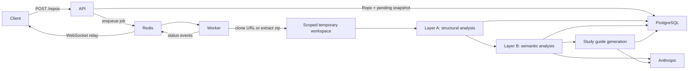

# Current architecture

**Status:** Current through Phase 3, merged 2026-08-13 in PR #22.

Strata Learn is a Docker Compose-based modular monolith that ingests a Git repository or uploaded zip, extracts deterministic structural facts, enriches them with citation-grounded LLM analysis, and assembles the result into a study guide. Authentication, quizzes, and the functional frontend remain future phases.

## System components

| Component | Technology | Current responsibility |
|---|---|---|
| API | FastAPI | Health, repository ingestion, repository/snapshot lookup, progress WebSocket, and study guide lookup |
| Worker | arq | Source preparation, Layer A analysis, Layer B analysis, study guide generation, persistence, and status publication |
| Database | PostgreSQL 16 | Repositories, snapshots, code units, module summaries, pattern claims, trade-off cards, and study guides/sections/citations |
| Queue/events | Redis 7 | arq jobs, temporary zip bytes, and snapshot progress pub/sub |
| Frontend | React/Vite | Scaffold and placeholder routes only; functional UI begins in Phase 4 |
| LLM provider | Anthropic | Claude-backed structured output for all current Layer B tasks |

The code exposes an `LLMProvider` protocol and a deterministic `FakeLLMProvider` for tests. An OpenAI production provider is planned but not implemented.

## Indexing flow



### Source preparation

- Git sources are pre-checked by the API and cloned independently by the worker.
- Zip uploads are size/file-count validated; their bytes live temporarily in Redis so the API and worker do not require a shared filesystem.
- Each job uses a scoped temporary workspace that is cleaned after processing.
- Symlinks are excluded before source can reach the parser or an external LLM.

### Layer A: deterministic analysis

Layer A walks supported source files, detects Python and JavaScript/TypeScript, parses them with tree-sitter, extracts modules/classes/functions, builds a dependency graph, and identifies likely entry points. It persists `CodeUnit` rows and structural JSON on `AnalysisSnapshot` without making LLM calls.

### Layer B: semantic analysis

Layer B runs after Layer A and currently uses one Anthropic model for three tasks:

- module summaries;
- architectural pattern detection;
- trade-off extraction.

The implementation bounds request volume, validates model-provided evidence against Layer A facts, and stores prompt version and model provenance with every result. Automated tests use `FakeLLMProvider`; real provider calls occur only during manual checkpoints or normal application use.

Versioned templates under [`docs/prompts/`](prompts/) are runtime inputs, not passive prose.

### Study guide generation

Runs after Layer B and assembles its output (plus Layer A facts) into a study guide: Overview, Architecture, Trade-offs, Glossary, and Deep-Dive sections, each with citations back to real source lines. The only new LLM call is short labels for a Mermaid component diagram built from the (already-deterministic) dependency graph; every other section is deterministic formatting of already-generated, already-cited Layer B rows. A crash between Layer B's commit and the guide's commit resumes on redelivery without re-running Layer B's billed calls, reacquiring source pinned to the originally analyzed commit rather than the branch's current tip.

## Persistence model

Implemented tables are:

- `User` — modeled for later authentication but not wired into request handling;
- `Repo` — an ingested source and pointer to its latest snapshot;
- `AnalysisSnapshot` — one indexed state plus status and Layer A graph data;
- `CodeUnit` — a parsed module, class, or function;
- `ModuleSummary`, `PatternClaim`, and `TradeoffCard` — citation-grounded Layer B output;
- `StudyGuide`, `Section`, and `Citation` — the assembled study guide and its per-claim citations.

Quiz, question, attempt, and answer-submission tables are not implemented yet.

## Status lifecycle

```text
pending → parsing → analyzing → generating → ready
                            ↘ failed
```

The worker commits final Layer B rows with `generating` atomically, and the study guide rows with `ready` atomically, to reduce duplicate paid work under arq's at-least-once delivery model. A redelivery landing between those two commits resumes directly into study guide generation instead of repeating Layer B.

## Implemented API

| Method | Path | Purpose |
|---|---|---|
| `GET` | `/health` | Liveness response |
| `POST` | `/repos` | Validate and enqueue a Git URL or zip upload |
| `GET` | `/repos` | List repositories |
| `GET` | `/repos/{repo_id}` | Fetch a repository |
| `GET` | `/repos/{repo_id}/snapshot` | Fetch its latest analysis snapshot |
| `GET` | `/repos/{repo_id}/study-guide` | Redirect to its generated study guide |
| `GET` | `/study-guides/{study_guide_id}` | Fetch a study guide with ordered sections and citations |
| `WS` | `/repos/{repo_id}/progress` | Stream persisted and pub/sub status updates |

The broader API in the [original project plan](design/original-project-plan.md) is a target surface, not a description of current routes.

## Deployment topology

Local Docker Compose starts five services: PostgreSQL, Redis, API, worker, and web. The worker mounts `docs/prompts` read-only because prompt templates live outside the backend image. The current deployment target is local development; VPS hosting remains planned for Phase 7.

## Decision references

Major architectural rationale lives in [`docs/adr/`](adr/), especially:

- [ADR-001: modular monolith](adr/ADR-001-modular-monolith.md)
- [ADR-002: async job queue](adr/ADR-002-async-job-queue.md)
- [ADR-003: LLM provider abstraction](adr/ADR-003-llm-provider-abstraction.md)
- [ADR-006: Layer A/Layer B separation](adr/ADR-006-layer-a-layer-b-separation.md)
- [ADR-008: no local-filesystem ingestion](adr/ADR-008-no-local-filesystem-ingestion.md)
